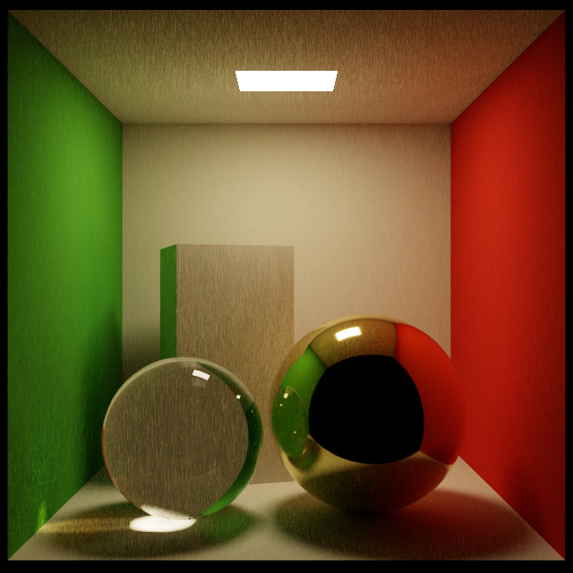
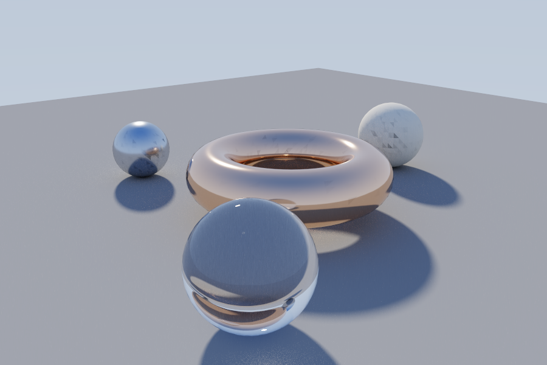
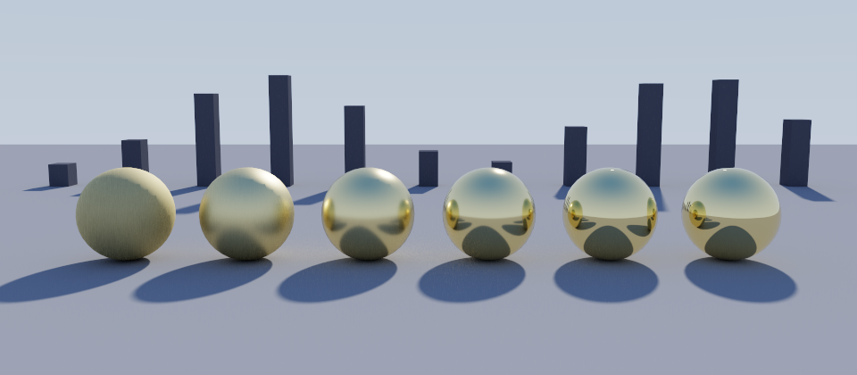
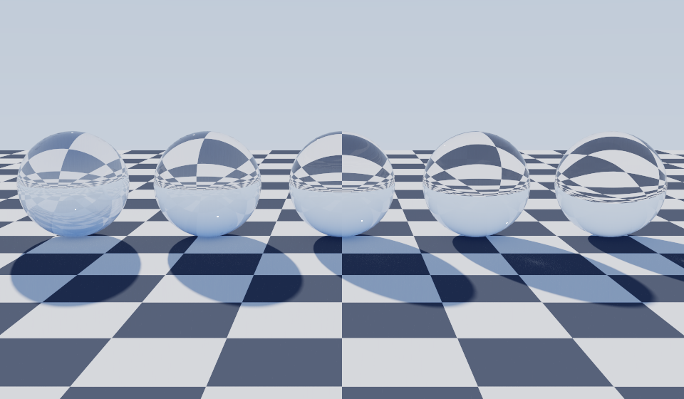
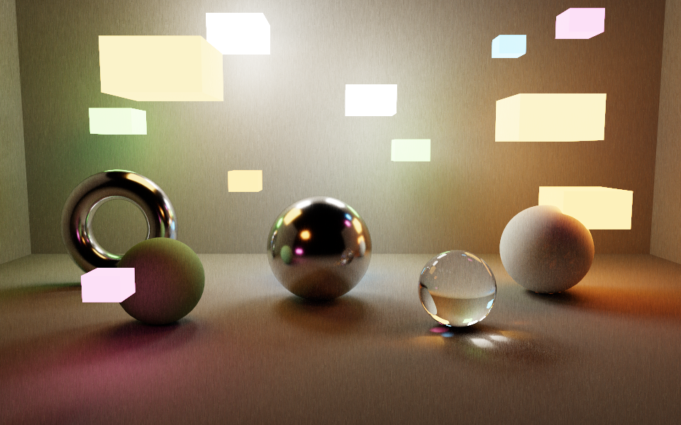
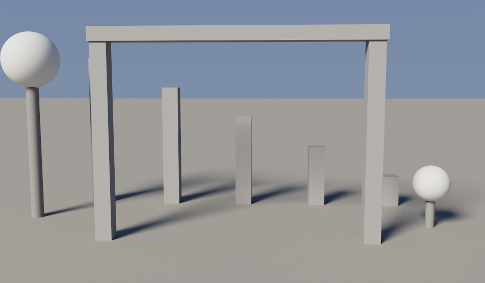
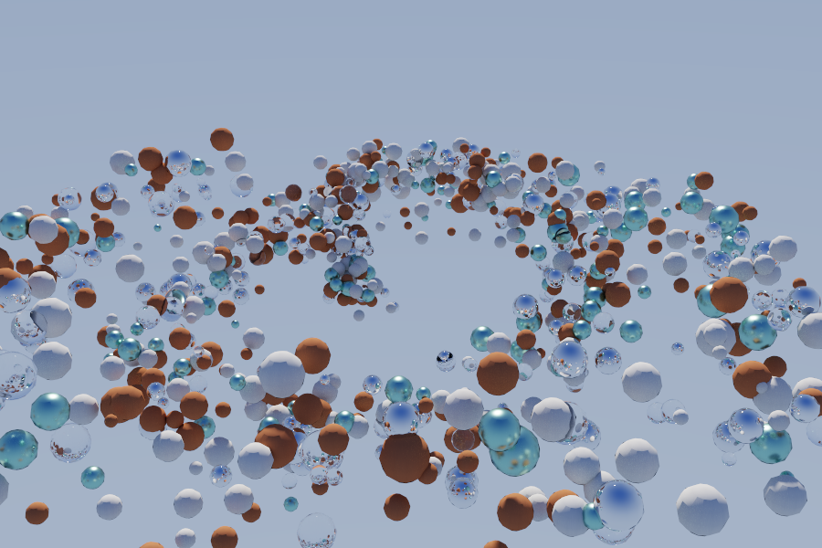
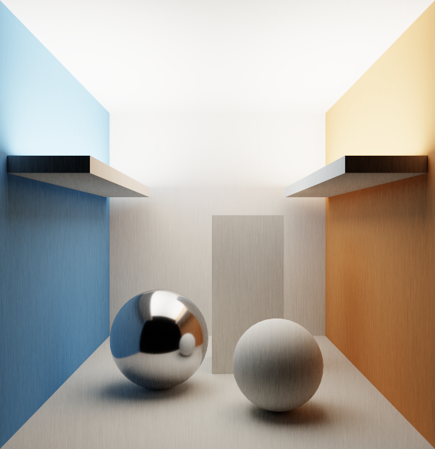
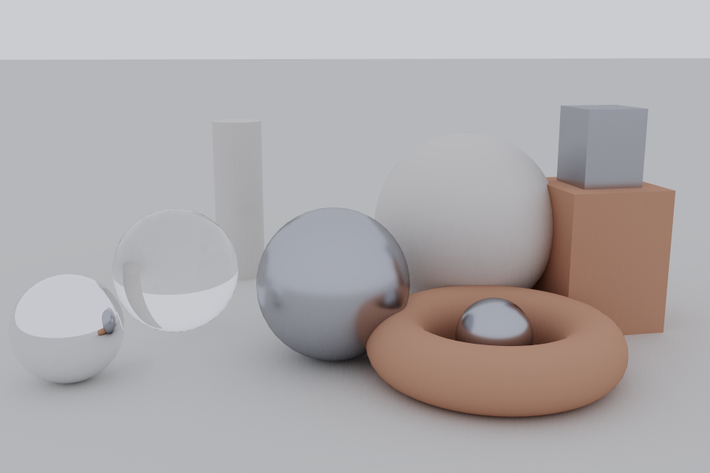

# irena

A physically based path tracer written in C++20. Ray traversal and shading run as
OpenCL kernels; Vulkan owns the shared framebuffer allocation and the resolve
pass. Both APIs are loaded dynamically at runtime, so there is no SDK to install,
nothing to link against, and no third-party dependency of any kind.

```
4440 triangles, 2803 bvh nodes, depth 19, built in 1 ms
640x640 at 4096 spp, 10 bounces, 1024 cycles of 4 spp, traced in 41.77 s
40.2 Mpaths/s, tier 1 (shared host allocation, zero copy)
```
<sup>Cornell box on an Apple M4 Pro.</sup>

## Design

**Dynamic loading, not linking.** `src/cl_min.hpp` declares the slice of the
OpenCL ABI the renderer actually uses, and the entry points are resolved with
`dlsym` at startup. The same is true of Vulkan. Nothing is linked against, so the
binary builds on a machine with no OpenCL headers and runs on one with a
different driver.

**Vulkan is optional and negotiated.** The renderer probes what both drivers
support and picks the best interop tier available, falling back all the way to
staged copies. A missing Vulkan loader is reported, not fatal.

**Determinism is a feature.** PCG32 is integer-only and the kernel avoids every
construct that reassociates per vendor, so two conformant devices should produce
bit-identical images. `--compare` exists to prove it and exits nonzero on a
mismatch, so it drops straight into CI.

### Renderer

| | |
|---|---|
| Acceleration | binned SAH BVH, 16 bins, surface-area-heuristic leaf termination |
| Traversal | explicit 32-entry stack, slab test, Möller–Trumbore |
| Integrator | unidirectional path tracing, next event estimation, MIS with the power heuristic |
| Materials | Lambertian, GGX metal with Smith masking and Schlick Fresnel, smooth dielectric with total internal reflection |
| Lights | single-sided emissive triangles sampled by area with a CDF, plus a cone-sampled sun |
| Environment | vertical gradient sky |
| Sampling | PCG32, cosine hemisphere, GGX half-vector, uniform cone, unbiased Russian roulette |
| Output | ACES filmic PNG, optional 32-bit PFM |

### Interop tiers

The renderer negotiates how OpenCL and Vulkan share the accumulation buffer,
choosing the best tier both drivers actually support:

| Tier | Mechanism | Requires |
|---|---|---|
| 2 | fd import | `cl_khr_external_memory_opaque_fd` or `cl_khr_external_memory_dma_buf`, plus `cl_khr_semaphore` |
| 1 | shared host allocation | `VK_EXT_external_memory_host` |
| 0 | staged copy | nothing, always available |

Tier 1 allocates the accumulator at the alignment Vulkan reports, imports the
same pages into both APIs, and runs a Vulkan command buffer over the result that
OpenCL wrote. On unified-memory parts this is genuinely zero copy. `--no-vulkan`
forces tier 0, which is also the correctness reference: every tier must produce
identical output.

### Portability

Verified on one machine: an Apple M4 Pro, OpenCL 1.2 through Apple's ICD, Vulkan
1.1.357 through MoltenVK, 20 compute units, 256 max workgroup. It reaches interop
tier 1. Builds warning-free at `-Wall -Wextra` on clang and gcc.

That single platform is why the constraints below are strict rather than
cautious. Apple's driver exposes OpenCL 1.2 and no interop extensions at all, so
tier 2 is unreachable here and `VK_EXT_external_memory_host` through MoltenVK
carries the shared allocation instead, at a 16 KB host pointer alignment. The
tier-2 code path and the Linux loader branch are written to spec but have never
been executed — treat them as a best effort, not a guarantee.

Rules the kernel follows so it runs unmodified elsewhere:

- OpenCL C 1.2 only, built with `-cl-std=CL1.2` and retried without options if a
  driver rejects them. macOS caps out at 1.2, so this is the real floor.
- Compiled from source, never SPIR-V. NVIDIA does not expose `cl_khr_il_program`.
- `clCreateCommandQueue`, not the 2.0 replacement that 1.2 stacks lack.
- No `float3` in host-shared buffers. `Float4` is `static_assert`ed to 16 bytes.
- No `native_*` math and no fast-math, both of which reassociate per vendor.
- No `printf` in kernels.
- Workgroup shape derived from `CL_KERNEL_WORK_GROUP_SIZE`, never assumed.
- Integer-only PCG32, so two conformant devices produce bit-identical images.

The ICD is found at `OpenCL.framework` on macOS and `libOpenCL.so.1` on Linux.
Vulkan resolves to `libvulkan.1.dylib` or MoltenVK, and `libvulkan.so.1`. macOS
builds define `CL_SILENCE_DEPRECATION`, since Apple deprecated OpenCL in 10.14
while keeping it functional.

## Samples

These two are the reference scenes. They ship in [scenes/](scenes/) and
reproduce with a single command.

### Cornell box



4,440 triangles at 640x640, 4096 spp, 10 bounces, no environment light. A brass
sphere and a glass sphere under a single emissive quad, the only light in the
scene. Everything outside the direct lighting — the color bleeding onto the
ceiling, the caustic under the glass, the room reflected in the brass — is pure
path-traced indirect illumination.

```bash
./build/irena scenes/cornell.scene
```

### Showcase



8,146 triangles at 900x600, 2048 spp, 8 bounces, sun and sky. A copper torus,
steel and ivory spheres, and a glass sphere on a diffuse floor — all three BSDFs
lit by the environment rather than an area light, with no emissive geometry at
all.

```bash
./build/irena scenes/showcase.scene
```

## Gallery

Seven more scenes, each built to isolate one part of the renderer rather than to
look good. They ship in [scenes/](scenes/) alongside the two above, and a
directory run covers the whole set:

```bash
./build/irena scenes
```

Every one is authored at Cornell's working scale, with the camera between 540
and 690 units from what it is pointed at. That is not a stylistic choice — see
the ray epsilon note under [known limitations](#known-limitations).

### Roughness ladder



9,254 triangles at 960x420, 2048 spp, sun and sky, traced in 3.6 s. Six GGX
metals, rough on the left to mirror on the right, at roughness 0.80, 0.45, 0.25,
0.13, 0.06 and 0.02. The ladder deliberately straddles the kernel's 0.08
smooth-metal cutoff: the two on the right take the specular path and skip next
event estimation entirely, picking the sun up only when a BSDF ray lands on the
disc, while the four on the left are sampled against both the sun and the BSDF
through MIS. The fins behind exist so the mirror end has something with an edge
in it to reflect.

```bash
./build/irena scenes/roughness.scene
```

### Index ladder



12,008 triangles at 960x560, 6144 spp, 20 bounces, traced in 17.9 s. Glass
spheres at IOR 1.20, 1.33, 1.52, 1.77 and 2.42 over a checkerboard, which gives
refraction a known pattern to distort: the inversion tightens and the band of
total internal reflection around the rim widens as the index climbs. The depth
is set to 20 for headroom, though Russian roulette kills these paths early
enough that 8 is visually indistinguishable here.

```bash
./build/irena scenes/dielectric.scene
```

### Lanterns



11,462 triangles at 960x600, 2048 spp, 144 emissive triangles, traced in 17.0 s.
Twelve emitters in a black environment, so every lit pixel arrives through the
area-weighted light CDF and nothing else. The panels deliberately span a 17x
range in area and a 9x range in radiance, and the two do not correlate: the CDF
weights by area alone, so the small bright emitters are exactly the case where
its picks are worst matched to where the energy actually is.

```bash
./build/irena scenes/lanterns.scene
```

### Penumbra



4,018 triangles at 960x560, 2048 spp, 6 bounces, traced in 2.9 s. A sun at 10
degrees of angular radius, wide enough that shadow softness tracks occluder
height plainly: the five pillars step from 42 to 210 units tall and their shadows
go from near-sharp to fully diffuse, and the two spheres make the same comparison
at a fixed occluder size. Exercises cone sampling and the irradiance-to-radiance
conversion, which is what makes a wide sun dimmer per steradian rather than
brighter overall.

```bash
./build/irena scenes/penumbra.scene
```

### Swarm



100,800 triangles at 900x600, 2048 spp, traced in 10.7 s. An order of magnitude
more geometry than anything else here, and clustered rather than uniform, which
is the distribution the binned SAH split has to earn its keep on. The BVH comes
out 65,321 nodes at depth 22 and builds in 14 ms. Against the roughness ladder —
same lighting, same bounce count, 11x less geometry — throughput falls only from
229 to 103 Mpaths/s.

```bash
./build/irena scenes/swarm.scene
```

### Cove



3,778 triangles at 620x640, 12288 spp, 20 bounces, traced in 82.4 s. Its four
emissive triangles face straight up into a ceiling cove and emission is
single-sided, so no camera ray and no first-bounce shadow ray can reach a light
at all — every photon in frame has bounced at least twice. Warm and cool walls
make the transport visible as color rather than as brightness. It is by far the
slowest scene of the set, and the residual noise on the floor is the honest cost
of an integrator with nothing useful to importance sample.

```bash
./build/irena scenes/cove.scene
```

### Studio



12,954 triangles at 900x600, 4096 spp, traced in 13.0 s. A constant environment
and no emissive geometry, which leaves the renderer with nothing to sample:
`light_count` is zero, the sun is off, and every path is BSDF sampled. Under
uniform illumination the only shading cue left is visibility, so the contact
darkening where the objects meet the floor and each other is the entire image.
Cosine sampling a constant environment is an exact estimator for the diffuse
surfaces, which is why a scene with no direct lighting at all converges this
cleanly.

```bash
./build/irena scenes/studio.scene
```

## Installation

macOS and Linux. Requires a C++20 compiler (clang or gcc) and a GPU driver
exposing OpenCL. Nothing else — no package manager step, no submodules.

No CMake needed:

```bash
./build.sh
```

That writes `build/irena`. Nothing is copied onto the `PATH`, so invoke it as
`./build/irena` from the repository root. Or with CMake:

```bash
cmake -B build -DCMAKE_BUILD_TYPE=Release && cmake --build build -j
```

Verify the toolchain sees your hardware:

```bash
./build/irena --list
```

This prints every OpenCL device with its compute units, memory, and interop
extensions, followed by the Vulkan device and the capabilities that decide the
interop tier. It is also the fastest way to check whether `VK_KHR_ray_query` is
available.

The kernel is read from `kernels/trace.cl` at runtime. The renderer walks up
from the working directory to find it, so running from the repository root or
from `build/` both work. The CMake build also copies `kernels/` next to the
binary.

## Usage

There is no install step: the build leaves the binary at `build/irena` and every
command below is run from the repository root, so the kernel and the sample
scenes resolve on relative paths.

Render one scene, written next to the input as `<name>_output.png`:

```bash
./build/irena scenes/cornell.scene
```

Render every scene in a directory into `<directory>/output/<name>.png`:

```bash
./build/irena scenes
```

Both `.obj` and `.scene` files are accepted. When `foo.obj` and `foo.scene` both
exist in a directory, only the `.scene` is rendered.

### Options

```
--list                    show OpenCL and Vulkan devices
--device N                OpenCL device index
--width N  --height N     override resolution
--samples N               override samples per pixel
--bounces N               override maximum path length
-c N, --cycles N          split the render into N accumulation passes
--exposure F              override tonemap exposure
--clamp F                 clamp per-sample radiance, suppresses fireflies
--hdr                     also write a .pfm alongside the png
--no-vulkan               skip Vulkan entirely, stay on staged copies
--compare A.pfm B.pfm     diff two hdr renders
-h, --help                usage
```

Every override applies to all scenes in a directory run, which makes a quick
low-sample pass over the whole set easy:

```bash
./build/irena scenes --samples 64 --width 320 --height 320
```

### Output

Each render reports geometry, lighting, sampling, timing, and radiance
statistics:

```
opencl   Apple M4 Pro (OpenCL 1.2)
vulkan   Apple M4 Pro (api 1.1.357)
interop  tier 1 (shared host allocation, zero copy)
inputs   1

cornell.scene
  4440 triangles, 2803 bvh nodes, depth 19, built in 1 ms
  2 emitters, sun off, sky 0.00 0.00 0.00
  640x640 at 16 spp, 10 bounces, 4 cycles of 4 spp
  traced in 0.18 s, 37.0 Mpaths/s
  radiance min 0.000 mean 0.200 max 24.0
  vulkan resolve pass on shared memory ok
  wrote scenes/cornell_output.png
```

Non-finite pixels and an entirely black image are called out as warnings rather
than left for you to notice in the PNG. A scene that fails to load is reported
with its filename and the directory run continues; the exit code is 1 if any
scene failed.

## Scene format

`.obj` files load directly, with materials from the referenced `.mtl`. The camera
is framed automatically from the bounding box and the scene is lit by a default
sun and sky.

A `.scene` file gives full control:

```
mesh cornell.obj
camera 278 273 -800  278 273 280  39.3
resolution 640 640
samples 512
bounces 10
cycles 64
exposure 1.0
clamp 40
environment 0 0 0
sky 0.12 0.22 0.50  0.42 0.50 0.66
sun 0.4 0.8 -0.35  2.6 2.45 2.2  1.5
```

| Directive | Arguments | Default |
|---|---|---|
| `mesh` | path to an `.obj`, relative to the scene file | required |
| `camera` | position xyz, target xyz, vertical fov in degrees | framed from bounds |
| `resolution` | width, height | 800 600 |
| `samples` | samples per pixel | 256 |
| `bounces` | maximum path length | 8 |
| `cycles` | accumulation passes | derived from batch |
| `exposure` | tonemap exposure | 1.0 |
| `clamp` | per-sample radiance ceiling, 0 disables | 0 |
| `environment` | constant rgb environment radiance | — |
| `sky` | zenith rgb, horizon rgb | — |
| `sun` | direction xyz, irradiance rgb, angular radius in degrees | off |

`sun` takes an irradiance rather than a radiance: it is what a surface facing the
sun receives, which is far easier to reason about than the disc's radiance. The
angular radius is clamped to 0.05–60 degrees. Specifying any of `environment`,
`sky`, or `sun` replaces the default lighting entirely. Unknown directives and
wrong argument counts are reported with a file and line number.

### Materials

MTL mapping: `Ke` makes an emitter, `Ni` with `d < 1` or `illum 6/7` makes a
dielectric, a bright `Ks` or `illum 3/5` makes a metal, and `Ns` converts to
roughness. Everything else is Lambertian. Defaults are a 0.75 grey albedo, 0.35
roughness, and an IOR of 1.5.

```
newmtl brass          newmtl glass
Kd 0.30 0.24 0.10     Kd 0.98 0.99 0.99
Ks 0.94 0.78 0.36     Ni 1.52
Ns 340                d 0.05
illum 3               illum 7
```

## Cycles

A render is accumulated over several passes rather than one long kernel launch.
The engine derives the pass count as `ceil(samples / batch)`, where batch
defaults to 4 samples per pass. `-c N` sets the pass count directly, so each
pass carries `ceil(samples / N)` samples, and the reported line reads
`N cycles of M spp`.

On the M4 Pro pass size barely matters. Cornell at 640x640, 256 spp, median of
three runs:

| cycles | samples per pass | time |
|---|---|---|
| 8 | 32 | 2.58 s |
| 64 | 4 | 2.59 s |
| 256 | 1 | 2.67 s |

The first two are within run-to-run spread of each other. Only one sample per
pass is reliably slower, by about 3%, which is dispatch overhead showing up once
there is no longer enough work per launch to hide it. The default of 4 sits in
the flat region and there is nothing to gain by tuning it here.

This is worth re-measuring on unfamiliar hardware rather than trusting: the
balance between per-thread register pressure and per-dispatch overhead is a
property of the driver and the part, and `-c` exists to find it. Every pass count
converges to the same image, but pass size feeds the RNG seed, so two renders
with different `-c` are not bit-identical.

## Cross-device validation

```bash
./build/irena scene.scene --samples 256 --hdr
./build/irena --compare a.pfm b.pfm
```

`--compare` prints the maximum absolute difference, the RMSE, and whether the
two images are bit-identical. Same arguments on two devices must give
`identical yes`. The tool exits 0 when identical, 2 on a mismatch, and 1 if the
dimensions differ. Batch size feeds the RNG seed, so keep it constant across the
runs being compared.

Run-to-run determinism on one device is verified. Cross-device is not: this
machine exposes a single OpenCL platform.

## Known limitations

- Megakernel, not wavefront. Divergence is unaddressed.
- BVH is built on the CPU. A GPU LBVH build is the natural next step.
- No textures. Materials are constant across a surface.
- The sky is sampled only by BSDF rays, so a bright sky converges slowly.
  The sun is sampled explicitly and does not have this problem.
- Caustics through dielectrics are noisy. `clamp` trades a little bias for a
  large variance reduction.
- Convergence measured against an 8192 spp reference is 2.18x per 4x samples,
  which is the expected 1/sqrt(N). The residual noise concentrates in dark
  purely-indirect regions such as the Cornell ceiling, which the light faces
  away from, and in dielectric caustics. Stratified or low-discrepancy sampling
  is the next real improvement; delaying Russian roulette was measured and made
  quality per second worse, so it was not adopted.
- `RAY_EPS` is an absolute 1e-4, so the renderer has a working world scale rather
  than being scale invariant. Shadow rays start at `hit.position + n * RAY_EPS`,
  and `hit.position` is `origin + dir * t`, whose float32 error grows with `t`.
  Past roughly 800 units of ray travel that error overtakes the offset, shadow
  rays re-hit the surface they left, and smooth-shaded meshes break out in
  triangular acne. It reproduces on one sphere at the origin with nothing else in
  the scene, moving the camera from 520 units back to 8000 and narrowing the fov
  to match — geometry, lighting and tessellation all held fixed. Cornell is
  unaffected because it is 556 units across. Every gallery scene is authored to
  stay inside that range. The fix is to scale the offset with `t` and the
  coordinate magnitude instead of using a constant.
- No hardware ray tracing path yet. `--list` reports whether `VK_KHR_ray_query`
  is available, which is where that will hook in.
